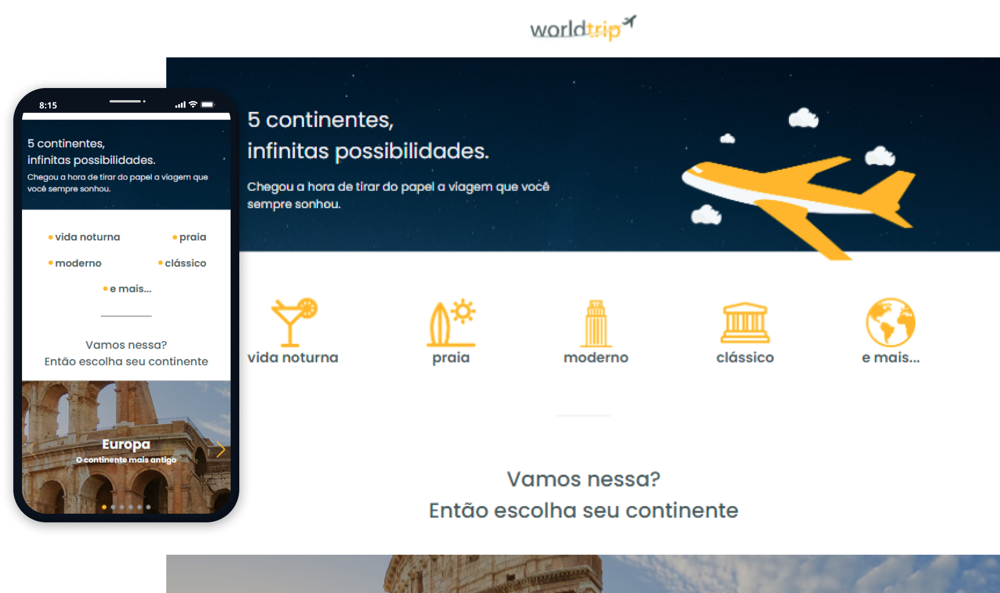
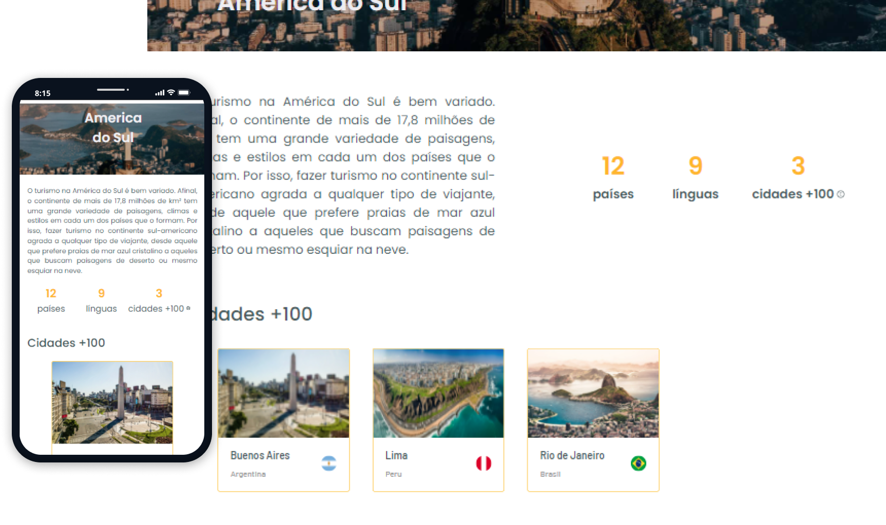

# Shop App

A challenge from the Ignite React track (Rocketseat course) that was proposed to create a responsive travel site from model in Figma using Chakra Ui.

The data used are mocked in api routes and obtained from reference sites informed by rocketseat, these are:

- [The 100 most popular city destinations](https://www.visualcapitalist.com/the-100-most-popular-city-destinations/)
- [The most visited cities world 2019](https://bigseventravel.com/the-most-visited-cities-world-2019/)

## Screenshots




## Setup

Go to the desired folder and run

```bash
  $ git clone https://github.com/matheustsdev/worldtrip.git

  $ cd worldtrip

```

Then, install the packages and run the development server with:
(NPM)

```bash
  $ npm install

  $ npm run start
```

or: (YARN)

```bash
  $ yarn

  $ yarn start
```

And you're ready to go!

## Stack

**Front-End:** React, NextJs, Typescript, Swiper, ChakraUI and Axios

## Autor

- Github: [@matheustsdev](https://github.com/matheustsdev)
- Linkedin: [Matheus Teixeira](https://www.linkedin.com/in/matheust0105/)
